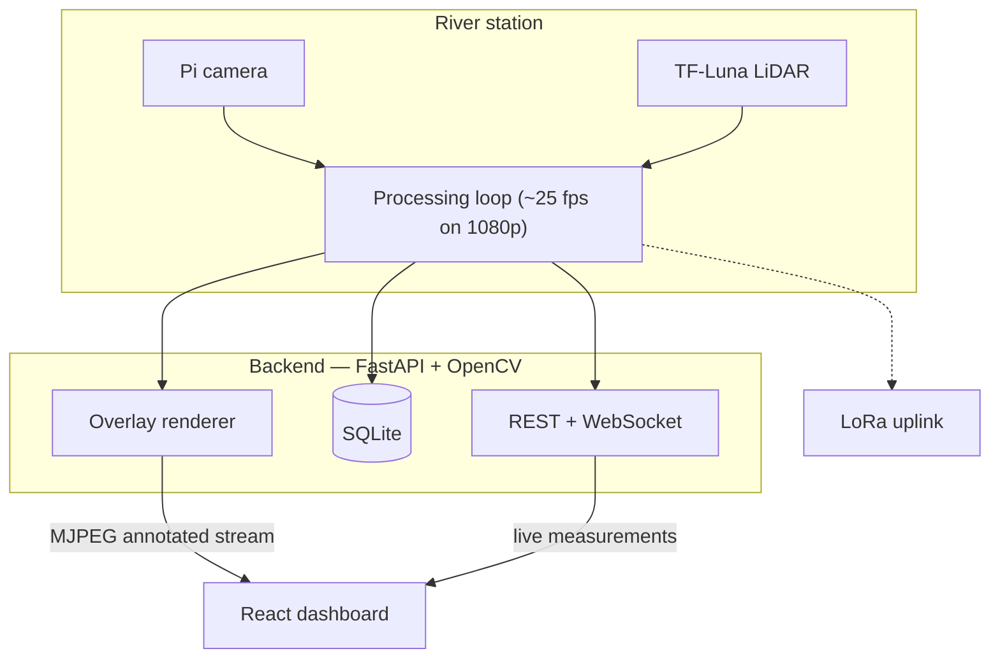

# RiverFlow Monitor


**Real-Time Non-Contact River Monitoring System** — a web application that
measures water level, surface velocity, and floating debris from video and
LiDAR without touching the water, and visualizes everything in a live
dashboard.

## Overview

River monitoring today mostly means contact instruments (staff gauges,
current meters, float sensors) that are expensive, dangerous to install
during floods, and prone to damage and theft. RiverFlow Monitor explores a
non-contact alternative: a camera and a compact LiDAR on the riverbank, a
Raspberry Pi running the analysis, and a web dashboard that anyone can open
from anywhere.

The system measures:

- **Water level** — TF-Luna ToF LiDAR (primary sensor)
- **Surface velocity** — optical flow / LSPIV-style image analysis
- **Floating debris** — optional YOLO detection with unique-object tracking

Everything measured is either real or clearly labeled. See
*[Scientific integrity rules](#scientific-integrity-rules-enforced-by-this-system)*.

## Features

- **Live camera monitoring** with server-rendered overlays: ROI brackets,
  speed-colored flow arrows, debris boxes, water-edge line, and a telemetry
  HUD — toggleable mid-run without restarting processing
- **Draw the ROI directly on the video** (drag a rectangle on the camera
  frame instead of typing coordinates)
- **Real-time dashboard**: water level, surface motion (px) or velocity (m/s
  when calibrated), discharge (m³/s when fully calibrated), debris counts,
  flow direction, live charts
- **Water-level alerts**: configurable warning/danger thresholds with banner
  and browser notifications
- **Three honest run modes**: full (local backend), remote backend (tunnel or
  cloud URL), and clearly-labeled demo mode when no backend is reachable
- **Firebase authentication** with plain-username login (accounts managed in
  the Firebase Console — no credentials in code)
- **SQLite history** with time-range filtering, period comparison, CSV export
  and a printable summary report
- **Calibration workflow** that gates physical units: px values are never
  displayed as m/s until a real m/px scale exists
- **Sensors & comms services**: TF-Luna serial, LoRa payload service (mocks
  only under demo mode, always flagged)
- **Video management**: upload, process, and remove development videos;
  4K inputs are automatically downscaled for real-time processing
- **Installable app (PWA)**: add to home screen; the shell loads offline
  while data always comes live

## Technology Stack

| Layer | Technology |
|---|---|
| Frontend | React 19, TypeScript, Vite 7, Tailwind CSS 4, Recharts |
| Backend | Python 3.11+, FastAPI, Uvicorn, OpenCV, NumPy |
| Database | SQLite |
| Computer vision | Farneback optical flow, block-PIV (LSPIV), Sobel water-edge, optional YOLO (ultralytics) |
| Sensors / hardware | TF-Luna ToF LiDAR (serial), Raspberry Pi camera (V4L2), RTSP streams, LoRa uplink |
| Auth & hosting | Firebase Authentication, Firebase Hosting |
| Deployment | Docker (single container), cloudflared/ngrok tunnels, Render/Railway/Fly.io compatible |

## System Architecture



The frontend never computes measurements — it displays what the backend
measured. Full details: [docs/architecture.md](docs/architecture.md).

## Project Structure

```
riverflow-monitor/
├── backend/                  Python + FastAPI + OpenCV
│   ├── main.py               app entry (uvicorn), WebSocket /ws/live
│   ├── api/                  REST routers (video, measurements, config, calibration, validation)
│   ├── services/             camera manager (processing loop), overlay renderer, state, broadcast
│   ├── processing/           optical_flow, lspiv, flow_estimator, calibration, water_edge,
│   │                         debris_detector, tracking, pyorc_adapter, camera sources
│   ├── sensors/              TF-Luna LiDAR serial service
│   ├── communication/        LoRa service (modular, honest status)
│   ├── database/             SQLite storage
│   ├── models/               request schemas
│   └── tests/                pytest suite + live smoke test
├── frontend/                 React + Vite + TypeScript + Tailwind
│   └── src/
│       ├── components/       Layout, camera feed, cards, charts, controls
│       ├── pages/            Dashboard, Live Camera, Flow, Water Level, Debris,
│       │                     History, Validation, Calibration, System, Settings, Login
│       ├── services/         api (REST + auth), live (WebSocket), firebase, demo engine
│       └── types/            shared API payload types
├── docs/                     architecture, hardware wiring, debris-model guide
├── deploy/raspberry-pi/      systemd service + Pi setup instructions
├── .github/workflows/        CI (backend pytest + frontend tests & build)
├── Dockerfile                single-container deployment
└── firebase.json             Firebase Hosting configuration
```

The research workflow (notebooks, PyORC analysis) lives in the separate
`river-video-pyorc` repository — this repository contains the web application.

## Installation

```bash
git clone https://github.com/JoAhr25/riverflow-monitor.git
cd riverflow-monitor
```

**Backend** (Python ≥ 3.11):

```bash
cd backend
python -m pip install -r requirements.txt
```

Optional extras (install only when the hardware/model is available):
`pyserial` (LiDAR + LoRa serial), `ultralytics` (YOLO debris),
`pyopenrivercam` (PyORC reference PIV).

**Frontend** (Node.js ≥ 20):

```bash
cd frontend
npm install
```

## Environment Variables

All variables are **optional** — the app runs with zero configuration
locally. See [`.env.example`](.env.example) for the full list with safe
placeholders:

| Variable | Purpose |
|---|---|
| `VITE_API_BASE_URL` | Point the hosted frontend at a remote backend |
| `RIVERFLOW_CORS_ORIGINS` | Restrict API CORS to exact origins (production) |
| `RIVERFLOW_FRONTEND_DIST` | Custom frontend build path for the backend |
| `RIVERFLOW_AUTH_USER` / `_PASSWORD` / `_SECRET` | Optional backend session auth |

The Firebase web configuration is committed by design in
`frontend/src/services/firebase.ts` — it is public identifier data protected
by Firebase security rules, not a secret.

## Running the Application

Two terminals:

```bash
# 1 — backend (FastAPI + WebSocket + video stream on :8000)
python backend/main.py

# 2 — frontend (Vite dev server on :5173, proxies /api and /ws)
cd frontend
npm run dev
```

Open **http://localhost:5173**. Interactive API docs:
http://127.0.0.1:8000/docs

Sign in with the account configured in your Firebase project
(Authentication → Users). Login accepts a plain username — the app appends
an internal `@riverflow.app` suffix before talking to Firebase.

### Processing a development video

1. **Live Camera** → *Dev Video* → upload any H.264 MP4 (4K is downscaled
   automatically; HEVC/H.265 is not decodable — re-encode first).
2. **Start Processing** — the feed shows real overlays; charts and metrics
   update live; rows are written to SQLite.
3. Videos can be removed with the trash button next to **Start**.

Videos placed in `data/raw/` (repository root, gitignored) are listed as
available sources without uploading.

## Building

```bash
cd frontend
npm run build     # tsc type-check + vite production build → frontend/dist
```

The backend serves `frontend/dist` on the same port as the API (single-port
deployment) when it exists.

## Testing

```bash
# Backend: unit/integration tests (synthetic video, real optical flow — no fake data)
python -m pytest backend/tests -q

# Backend: live smoke test (requires the backend running)
python backend/tests/smoke_live.py

# Frontend: unit tests (chart helpers, statistics)
cd frontend && npm run test

# Frontend: strict type-check + production build
cd frontend && npm run build
```

CI runs the backend tests and the frontend build on every push/PR
([.github/workflows/ci.yml](.github/workflows/ci.yml)).

## Deployment

| Target | How |
|---|---|
| **Firebase Hosting** (frontend only) | `npm run build` in `frontend/`, then `firebase deploy --only hosting` from the repo root |
| **Quick share / thesis demo** | Run the backend, expose it: `cloudflared tunnel --url http://127.0.0.1:8000`, then paste the URL in *Settings → Remote Backend* on the hosted site |
| **Single container** | `docker build -t riverflow-monitor .` then `docker run -p 8000:8000 riverflow-monitor` |
| **Cloud (Render/Railway/Fly.io)** | Deploy the Dockerfile; set `RIVERFLOW_AUTH_*` and a long password |

Note: a public instance lets anyone upload videos and control processing —
enable authentication before sharing widely.

## Scientific integrity rules enforced by this system

- Image-space motion (px) is **never** silently displayed as m/s; without a
  configured physical scale the dashboard shows pixels and an "uncalibrated" status.
- Discharge (m³/s) is never computed without calibrated velocity, cross-section
  area, and a justified velocity correction factor.
- Debris detection returns **no detections** until a real model is configured.
- Sensors report honest states (`offline`, `not_connected`); nothing is
  simulated unless DEMO MODE is enabled, and mock values are always flagged.
- Calibration fields start as "not configured" and must come from real field
  measurements.

## PyORC role (research workflow, not a runtime dependency)

PyORC stays in the separate `river-video-pyorc` repository (`pyorc_env`,
pyorc 0.5.3). This webapp never requires it: `processing/pyorc_adapter.py`
reports honest availability ("not installed" by default), and the
**Testing & Validation** page shows the adapter status. With pyorc installed
and a real camera config present, the adapter runs projection + PIV for
reference flow computation. The Ngwerere example is a learning dataset only.

## Troubleshooting

| Problem | Fix |
|---|---|
| `npm run build` fails with type errors | Ensure Node ≥ 20 and a clean `npm install`; the build is strict |
| Uploaded 4K video ends immediately | The file is likely HEVC/H.265 — re-encode to H.264 MP4 (4K H.264 is auto-downscaled) |
| Live site shows demo mode | Expected without a backend — connect one via *Settings → Remote Backend* or run locally |
| Login rejected | Check the exact account in Firebase Console → Authentication → Users (`name@riverflow.app`, sign in with `name`) |
| Port 8000 already in use | Stop the old process or change the port: `python backend/main.py --port 8001` |
| Charts empty after processing stops | History page keeps everything; the live buffer only holds the session |
| `pyserial`/`ultralytics` import errors | They are optional — install only for real hardware/model use |

## Project Status

**Research prototype** (undergraduate thesis). The measurement pipeline,
dashboard, history, calibration gating, authentication, and deployment paths
work end-to-end; hardware integration (LiDAR serial, LoRa gateway, Pi
deployment) and the trained debris model are still being brought up. Not
production-ready — see *Current limitations* below.

### Current limitations

- Velocity stays image-space until real calibration data exists (by design).
- Discharge output is not implemented in the live loop yet (gating exists).
- Debris detection requires a trained YOLO model — reports "not configured" until then.
- Uniform m/px scale does not correct perspective; research-grade LSPIV
  belongs to the PyORC workflow.
- Camera water-edge detection is experimental and supplementary.
- LoRa/cloud ingest is architecture-only; no gateway is connected yet.

## Authors

Undergraduate thesis research project, developed by
[JoAhr Galanto (@JoAhr25)](https://github.com/JoAhr25) and the river
monitoring research team.

## License

No open-source license has been selected yet; the project is
all-rights-reserved by its authors by default. (Choosing one — e.g. MIT — is
a maintainer decision; happy path: add a `LICENSE` file and update this
section.)
