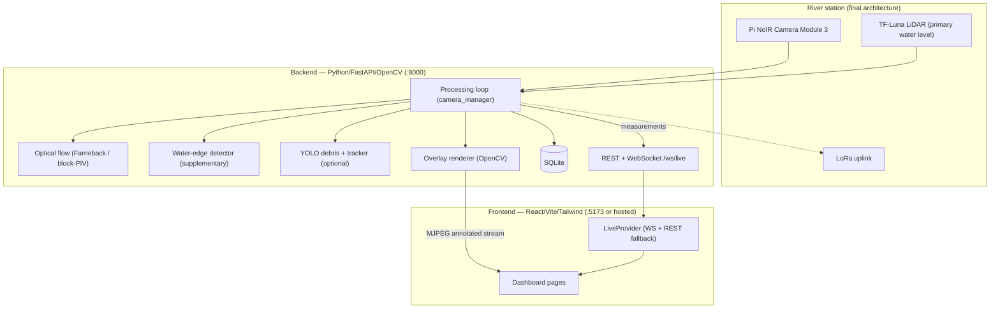

# System Architecture

RiverFlow Monitor is a two-part system: a Python backend that performs the
river measurements and renders them onto a live video stream, and a React
dashboard that visualizes water level, surface flow, and debris in real time.



## The life of a frame

1. **Source read** — uploaded video, live camera (V4L2), or RTSP/HTTP stream.
2. **Resolution cap** — inputs wider than `camera.process_max_width`
   (default 1920 px) are downscaled; 4K footage otherwise exceeds the
   real-time JPEG-encoding budget.
3. **ROI crop + grayscale**.
4. **Every `flow.frame_interval` frames** — Farneback optical flow on a
   ≤480 px copy (displacements rescaled back to frame pixels), water-edge
   Sobel detection, optional YOLO debris detection + centroid tracking.
5. **Overlay rendering** — ROI brackets, speed-colored flow arrows
   (length-normalized, direction/units truthful), debris boxes, water-edge
   line, HUD panel, calibration warning. Flags hot-reload ~5×/s.
6. **Distribution** — annotated JPEG becomes the MJPEG stream
   (`GET /api/video/stream`, up to 30 fps); the measurement payload is
   broadcast over WebSocket and logged to SQLite on `storage.log_interval_s`.

## Water level

```
TF-Luna distance → mounting height − distance → water level (m)
Camera water-edge → normalized edge position → supplementary estimate only
```

## Three run modes (graceful degradation)

| Mode | Condition | Behavior |
|---|---|---|
| Full | Backend reachable | Real measurements, server-rendered overlays |
| Remote backend | `VITE_API_BASE_URL` or Settings → Remote Backend | Same real data through a tunnel/cloud URL |
| Demo | No backend | Clearly-labeled simulated data; never mixed with real values |

## Authentication

Firebase email/password with plain-username login (an internal `@riverflow.app`
suffix is appended transparently). Accounts are managed in the Firebase
Console; no credentials live in the code. Optionally, the backend supports
session-cookie auth via `RIVERFLOW_AUTH_*` environment variables for public
deployments.

## Key modules

| Path | Role |
|---|---|
| `backend/services/camera_manager.py` | Processing loop, sources, pacing, hot-reload config |
| `backend/services/overlay.py` | OpenCV overlay renderer + MJPEG encoding |
| `backend/processing/optical_flow.py` | Farneback processor (downscaled compute, real-unit output) |
| `backend/processing/lspiv.py` | Block-PIV alternative processor (same interface) |
| `backend/processing/flow_estimator.py` | Calibration gating: px vs m/s |
| `backend/processing/pyorc_adapter.py` | Optional PyORC reference PIV (research workflow) |
| `backend/sensors/tf_luna.py` | TF-Luna serial service (mock only under demo mode) |
| `backend/communication/lora.py` | LoRa payload builder/sender (mock only under demo mode) |
| `frontend/src/services/live.tsx` | LiveProvider: single WebSocket + deduped REST fallback |
| `frontend/src/services/api.ts` | REST client with demo-mode fallbacks + auth |
| `frontend/src/components/CameraFeed.tsx` | MJPEG feed, status badges, demo canvas renderer |
